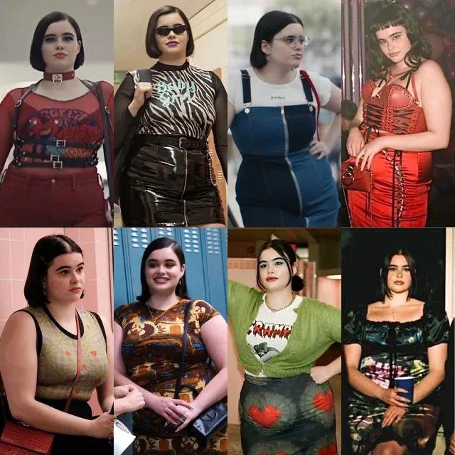

# Apresentação Fei

Clique na imagem para ser redirecionado ao vídeo de apresentação de Fei no Youtube.
 
 
 

Nome: Fei  
Personalidade: Educada, simpática e altamente eficiente, Fei transmite confiança e praticidade, auxiliando clientes de forma personalizada.  
Função: Recomendar roupas, sugerir combinações, apresentar novos estilos e permitir o teste virtual de roupas. Fei também responde dúvidas sobre materiais, tamanhos e disponibilidade de produtos.
 
A Fei foi criada para revolucionar a experiência de compra de roupas, oferecendo recomendações personalizadas e a possibilidade de testar roupas virtualmente. Seu objetivo é tornar o processo de escolha mais eficiente e prático, tanto em lojas físicas quanto no conforto de casa.

**A Fei será aplicada em:**

1. Provadores de lojas físicas: Atuando como uma assistente virtual que recomenda peças, sugere estilos e permite testes virtuais de roupas. Ao entrar no provador, o cliente pode interagir com a Fei para receber recomendações baseadas em seu estilo, tamanho e preferências. Fei simula as roupas diretamente no avatar, ajudando o cliente a visualizar como ficariam no corpo.

2. Metaquest 3 (realidade virtual): Permitindo que os usuários experimentem roupas e comprem diretamente online. No ambiente virtual, o usuário escolhe as peças de uma loja virtual, experimenta-as em tempo real com o auxílio da Fei e finaliza a compra online, tornando a experiência de compra digital mais imersiva.

Ela é uma jovem adulta do gênero feminino, transmitindo modernidade e conexão com tendências da moda. Seu cabelo roxo com estilo moderno reflete diversidade e criatividade, alinhando-se ao universo fashion. Fei usa de roupas estilosas e descoladas e possui expressões gentis e acolhedoras, transmitindo confiabilidade e incentivando a interação.

A escolha de elementos como a cor vibrante do cabelo e o estilo minimalista garante que a Fei seja reconhecida facilmente como uma assistente moderna e antenada no mundo da moda.

As suas inspirações foram a Amanda Bright (Life Is Strange: Double Exposure) e a Kat (Euphoria) por sua personalidade e vestuário.

  
  

 

Esse é o [link](Fei.mhb) para o arquivo .mhb de Fei. Para chegar ao resultado final, foi utilizado os softwares: MetaHuman Creator (criação de personagem), Bark (criação da voz da Fei), Unreal Engine (animação) e Microsoft Clipchamp (edição de vídeo).
